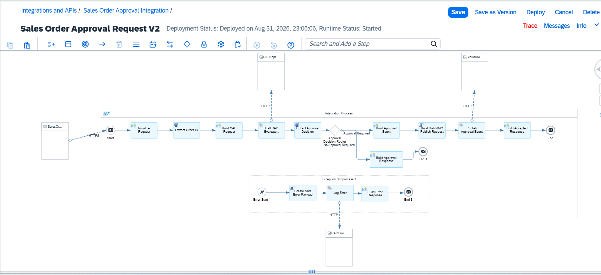
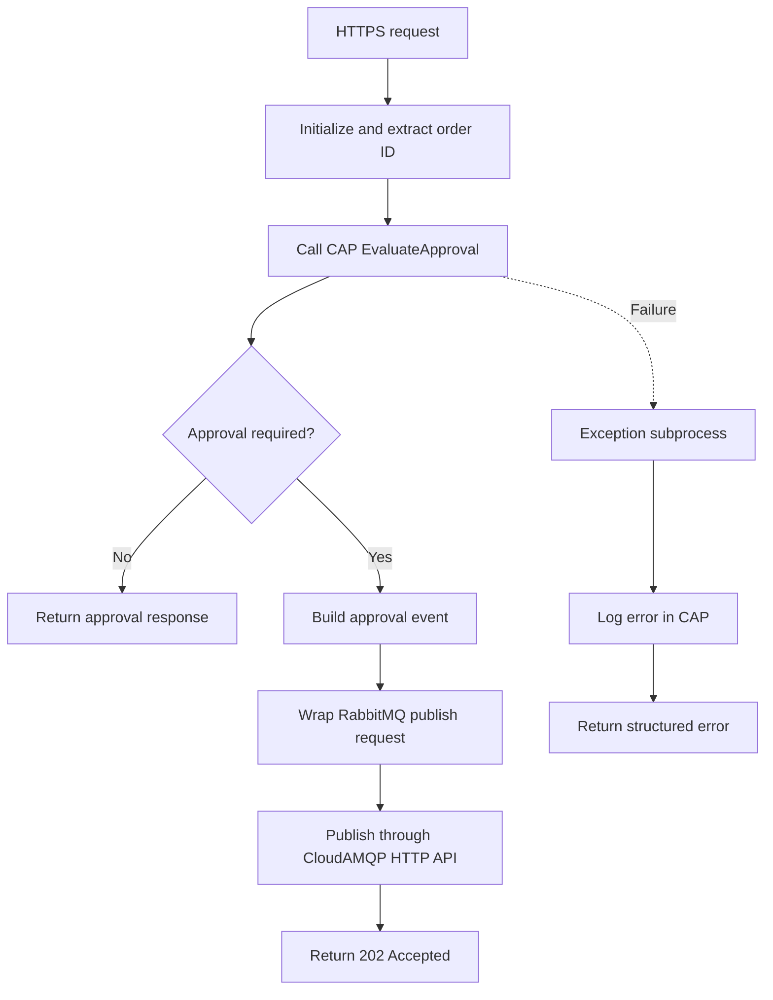

# SAP Integration Suite — Sales Order Approval

This package implements the integration layer for an event-driven sales-order approval process. It accepts an HTTPS request, asks the CAP service to evaluate the order, and publishes approval-required events to RabbitMQ. Orders that do not require approval receive an immediate response.

## Processing flow

## Main components

| Component | Responsibility |
|---|---|
| HTTPS sender | Receives the sales-order trigger from an API client or upstream system |
| Initialize Request | Sets correlation and integration-flow context |
| Extract Order ID | Validates and extracts `orderId` from the request |
| Build CAP Request | Creates the request for the CAP action |
| Call CAP EvaluateApproval | Calls the protected CAP `EvaluateApproval` action using OAuth 2.0 client credentials |
| Approval Decision Router | Separates approval-required and no-approval paths |
| Build Approval Event | Builds the event consumed by the asynchronous worker |
| Build RabbitMQ Publish Request | Wraps the event for the RabbitMQ-compatible HTTP publish API |
| Publish Approval Event | Publishes to `sales-order-approval.queue` through CloudAMQP/LavinMQ |
| Exception Subprocess | Creates a safe error response and records integration errors through CAP |

## Security material

The export contains credential aliases only. Secrets are configured separately in each Integration Suite tenant.

| Alias | Type | Purpose |
|---|---|---|
| `CAP_XSUAA_OAUTH` | OAuth2 Client Credentials | Calls the CAP evaluation and error-logging actions |
| `RABBITMQ_CREDENTIALS` | User Credentials | Authenticates to the CloudAMQP/LavinMQ HTTP API |

Never commit service-key JSON, client secrets, bearer tokens, passwords, or `.env` files.

## Runtime behavior

1. A client posts `{ "orderId": "SO1005" }` to the generated HTTPS endpoint.
2. The iFlow calls the CAP service to evaluate the order.
3. CAP returns the approval decision, correlation ID, event ID, reason, and approval path.
4. For an approval-required order, the iFlow publishes the event to RabbitMQ.
5. The Node.js worker consumes the message and starts the SAP Build Process Automation workflow.
6. The workflow routes the request through Sales Manager, Finance, and Business Head approval.

## Verified scenario

The restored tenant was tested with order `SO1005`:

- Postman trigger returned `202 Accepted`.
- Integration Suite message processing completed successfully.
- RabbitMQ delivered and acknowledged the event.
- The worker created `Sales Order Approval - SO1005`.
- Sales Manager, Finance, and Business Head tasks were approved.
- The SAP Build workflow reached `Completed`.

## Repository contents

| Path | Description |
|---|---|
| `sales-order-approval-iflow.zip` | Importable Integration Suite package export |
| `scripts/` | Readable Groovy scripts extracted from the export |
| `screenshots/` | Visual documentation for GitHub reviewers |

## Import and deployment

1. Import `sales-order-approval-iflow.zip` into SAP Integration Suite.
2. Create the security-material aliases listed above.
3. Verify the CAP receiver addresses and the CloudAMQP HTTP publish address for the target environment.
4. Save, validate, and deploy the iFlow.
5. Wait for runtime status `Started`, then use the generated HTTPS endpoint.

Environment-specific endpoints and credentials are intentionally excluded from this repository.
