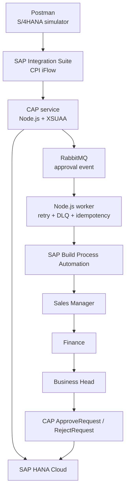

# Event-Driven Sales Order Approval on SAP BTP

[](https://github.com/sravanirepalli/event-driven-sales-order-approval-btp/actions/workflows/ci.yml)

An enterprise-grade proof of concept for extending sales-order approvals on
SAP Business Technology Platform without adding custom approval logic to the
ERP core.

The solution uses SAP Integration Suite, a CAP application with SAP HANA
Cloud, asynchronous messaging, a Node.js worker, and SAP Build Process
Automation. Postman represents the upstream sales-order client, while RabbitMQ provides the asynchronous messaging layer. The design keeps these integration boundaries replaceable for enterprise landscapes.

## Business scenario

Sales orders are evaluated using configurable business conditions. Orders
that require additional control are routed through the appropriate approval
path.

| Condition | Approval path | Reason |
| --- | --- | --- |
| Value >= 100,000 and risk is `HIGH` | Sales Manager -> Finance -> Business Head | `HIGH_VALUE_HIGH_RISK` |
| Discount >= 20% | Sales Manager -> Finance | `HIGH_DISCOUNT` |
| Value >= 100,000 | Sales Manager | `HIGH_VALUE` |
| No approval condition | Standard processing | `STANDARD_ORDER` |

## Implemented architecture



## End-to-end flow

1. Postman sends a sales-order request to the deployed Integration Suite iFlow.
2. Integration Suite securely calls the CAP `EvaluateApproval` action.
3. CAP reads the order from HANA Cloud and evaluates the business conditions.
4. When approval is required, CAP publishes a persistent message to RabbitMQ.
5. The worker consumes the event, prevents duplicate processing, enriches the
   workflow context from HANA, and starts SAP Build Process Automation.
6. SAP Build routes the order through Sales Manager, Finance, and Business
   Head tasks according to the selected approval path.
7. After the final decision, SAP Build calls the secured CAP
   `ApproveRequest` or `RejectRequest` action through a BTP destination.
8. CAP updates the approval request, sales-order status, and audit history in
   HANA Cloud.

## SAP BTP components

| Component | Responsibility |
| --- | --- |
| SAP Integration Suite | Receives the simulated source request, applies integration processing, and calls CAP |
| SAP CAP (Node.js) | Exposes OData APIs, evaluates approval rules, publishes events, and processes callbacks |
| SAP HANA Cloud / HDI | Stores sales orders, approval requests, processed events, audit logs, and error logs |
| SAP Build Process Automation | Executes the human approval workflow |
| SAP Destination service | Provides the controlled CAP API destination used by SAP Build Actions |
| XSUAA | Protects CAP APIs using OAuth 2.0 roles and scopes |
| Cloud Foundry | Runs the CAP service, database deployer, and background worker |
| RabbitMQ | Provides asynchronous messaging in the trial environment |

## Trial substitutions and production mapping

| Trial implementation | Production-aligned replacement |
| --- | --- |
| Postman simulates order creation/change | SAP S/4HANA business events and standard Sales Order APIs |
| RabbitMQ | SAP Event Mesh |
| HANA Cloud contains representative order data | S/4HANA remains the system of record; CAP stores extension data |
| No Cloud Connector | Cloud Connector is added only for an on-premise S/4HANA connection |

The boundaries are intentionally separated so the simulators can be replaced
without redesigning the approval workflow or CAP extension.

## Reliability and operational controls

- Persistent RabbitMQ messages and durable queues
- Retry exchange and retry queue with delayed redelivery
- Maximum retry count and dead-letter queue for permanent failures
- Idempotency using `ProcessedEvents`
- Duplicate approval-request prevention
- Acknowledgement only after successful processing and persistence
- Correlation IDs across Integration Suite, CAP, messaging, and workflow
- Audit and error records stored in HANA
- Graceful worker shutdown and controlled connection handling
- Workflow context enrichment from HANA before task creation

## Security

- CAP endpoints require authenticated users.
- XSUAA roles separate integration, approval, audit, and administration access.
- Integration Suite and SAP Build use OAuth-protected calls.
- SAP Build credentials are supplied to the worker through a Cloud Foundry
  service binding and `VCAP_SERVICES`.
- Secrets, tokens, service keys, destination credentials, and `.env` files
  must never be committed to Git.

## CAP API

Base path:

```text
/odata/v4/sales
```

| Operation | Purpose |
| --- | --- |
| `POST /EvaluateApproval` | Evaluates an order and publishes an approval event when required |
| `POST /ApproveRequest` | Completes the approval and marks the order `APPROVED` |
| `POST /RejectRequest` | Completes the approval and marks the order `REJECTED` |
| `POST /LogError` | Persists an integration or processing failure |
| `GET /SalesOrders` | Reads sales-order data according to the caller's role |
| `GET /ApprovalRequests` | Reads approval records according to the caller's role |

## Repository structure

```text
.
|-- db/                         HANA CDS model and sample data
|-- integration-suite/          Exported Integration Suite iFlow
|-- postman/                    End-to-end Postman collection
|-- sap-build/
|   |-- actions/                Exported CAP Actions project
|   `-- workflow/               Exported approval workflow project
|-- srv/                        CAP service definition and implementation
|-- worker/                     RabbitMQ consumer and SAP Build starter
|-- mta.yaml                    Multi-target application descriptor
|-- xs-security.json            XSUAA scopes and role templates
`-- readme.md
```

## Prerequisites

- SAP BTP subaccount with Cloud Foundry
- SAP HANA Cloud and HDI container entitlement
- SAP Build Process Automation entitlement
- SAP Integration Suite entitlement
- XSUAA and Destination services
- RabbitMQ service instance for this trial implementation
- Node.js 20 or later
- Cloud Foundry CLI and MultiApps plugin
- MTA Build Tool (`mbt`)

## Required external configuration

Create these platform resources before deployment:

1. RabbitMQ service instance named `sales-order-approval-rabbitmq`.
2. SAP Build Process Automation service instance named
   `sales-order-approval-process-automation`.
3. Destination `CAP_APPROVAL_API` for the secured CAP callback API.
4. SAP Build workflow and Actions projects imported or deployed from the
   exports in `sap-build/`.
5. Integration Suite iFlow imported from
   `integration-suite/sales-order-approval-iflow.zip`.

Do not document real client secrets or service-key values in this repository.

## Worker configuration

The worker is deployed without a route because it consumes messages in the
background.

| Variable | Purpose |
| --- | --- |
| `SAP_BUILD_API_URL` | SAP Build workflow-instances API URL |
| `SAP_BUILD_DEFINITION_ID` | Deployed workflow definition ID |
| `DEFAULT_APPROVER_EMAIL` | Fallback task recipient |
| `RABBITMQ_URL` | Optional local fallback when no RabbitMQ binding is available |
| `HDB_NODEJS_THREADPOOL_SIZE` | Optional HANA client thread-pool tuning |

OAuth client credentials are read from the
`sales-order-approval-process-automation` service binding. They are not stored
as application environment variables or source code.

## Build and deploy

### Automated validation

The approval policy is isolated from the CAP request handler and tested with
Node.js's built-in test runner. The tests cover rule precedence, threshold
boundaries, standard processing, and invalid monetary values.

```bash
npm test
```

GitHub Actions runs the tests, JavaScript syntax checks, and CDS compilation
on every push to `main` and on every pull request.

### Deployment

Install dependencies and validate the JavaScript:

```bash
npm ci
npm --prefix worker ci
node --check srv/sales-service.js
node --check worker/consumer.js
```

Build and deploy the MTA:

```bash
mbt build
cf deploy mta_archives/sales-order-approval_1.0.0.mtar
```

If the worker is deployed separately during development:

```bash
cf push sales-order-approval-worker \
  -p worker \
  --no-route \
  -b nodejs_buildpack \
  -m 256M \
  -k 512M \
  -u process \
  -c "npm start"
```

Set the non-secret workflow configuration and restart the worker after any
change:

```bash
cf set-env sales-order-approval-worker SAP_BUILD_API_URL "<workflow-api-url>"
cf set-env sales-order-approval-worker SAP_BUILD_DEFINITION_ID "<definition-id>"
cf set-env sales-order-approval-worker DEFAULT_APPROVER_EMAIL "<approver-email>"
cf restage sales-order-approval-worker
```

## Verification

1. Obtain the XSUAA and Integration Suite access tokens using the Postman
   collection.
2. Run `05 - Trigger Approval iFlow` with an order such as `SO1005`.
3. Confirm `202 Accepted` and capture the event and correlation IDs.
4. Verify the worker logs show the event was received, the SAP Build workflow
   was started, and the event was processed.
5. Complete the Sales Manager, Finance, and Business Head tasks in My Inbox.
6. Verify the SAP Build workflow instance is `Completed`.
7. Verify CAP received `POST /ApproveRequest` with HTTP 200.
8. Read the order through CAP and confirm its final HANA status is `APPROVED`.

## Proven end-to-end result

The reference test using order `SO1005` completed successfully:

- Integration Suite returned `202 Accepted`.
- The RabbitMQ worker started SAP Build Process Automation.
- All three human approval tasks completed.
- SAP Build called the CAP approval action successfully.
- CAP returned HTTP 200.
- The HANA sales-order record ended in status `APPROVED`.

## Scope statement

This repository demonstrates a production-aligned, enterprise-grade proof of
concept. It is not represented as a live production S/4HANA implementation.
Production adoption would add real S/4HANA connectivity, SAP Event Mesh,
environment-specific transport and governance, operational alerting,
performance testing, and enterprise security review.
